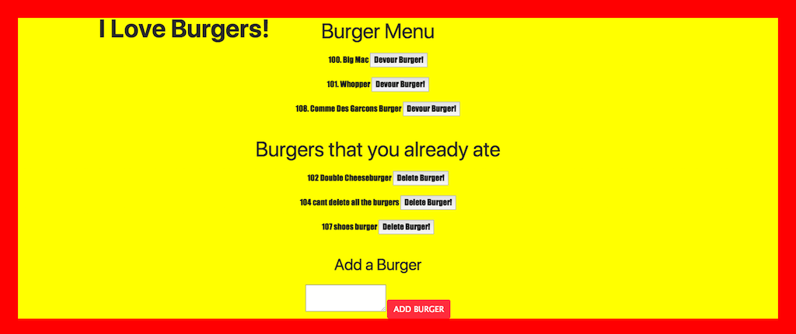

# burger for you, double burger for me!
## Full stack burger app

Welcome to my full stack burger app. 

**This full stack app uses:**
* Express 
* Node 
* Handlebars 
* mySQL 
* jQuery
* Bootstrap
* UIKit

From the start the user can choose to devour a pre-existing burger, or add any burger they would like, and then devour it.
When the user clicks "Devour Burger", the burger will disappear from the "Burger Menu" and re-appear in the "Burgers you already ate" section.
When the burger is "devoured" and re-displayed, it will now have a "Delete Burger" button attached so the user can get rid of it.

All actions are updated & reflected in mySQL database. 

I utilized bootstrap for the css grid layout and used UIKit for some basic css animations.

Thank you for viewing my first FULL STACK APPLICATION.
